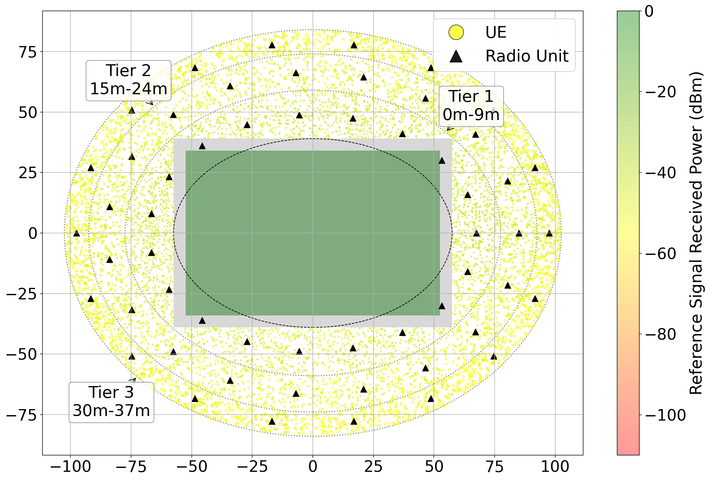

# Stadium RF Simulation (stadium-rf-sim)

Simulate a 5G RF environment in a multi-tier stadium with thousands of UEs and dozens of Radio Units (RUs), and stream metrics/control via a lightweight Open Fronthaul (OFH) client to an external gNodeB/E2Sim process. Includes visualization, CSV logging, and helper scripts.


## Highlights

- Multi-tier stadium geometry with configurable stands and technical area
- Dozens of perimeter RUs (56 by default), each with power, PCI, and channel assignment
- UE placement at scale (hundreds to tens of thousands) with realistic path loss, RSRP/RSRQ/SINR
- Handover and TX reference level control requests handled over the OFH TCP client
- Time-series experiment driver from CSV (target UEs vs. time) with smooth ramping
- Auto-generated logs and CSV snapshots of per-cell power over time
- High-quality plot generator for large numbers of UEs (PNG and PDF)


## Repository layout

- `main.py` — Entry point for experiments driven by `input.csv` (connects to E2Sim via OFH)
- `stadium_simulation.py` — Core simulation: geometry, UE placement, metrics, handover
- `radio_unit.py`, `user_equipment.py`, `stadium_tier.py` — Entities and RF math
- `ofh.py`, `client.py` — OFH transport and message handling, metrics/handover/power control
- `proto/` — Protobuf schema (`signaling.proto`) and generated Python modules
- `run_simulation.sh` — Convenience launcher with logging and optional k8s log capture
- `plot_8192_ues.py` — One-shot figure generator for static coverage plots
- `append_csv_linecount.sh` — Appends CSV line counts with timestamps to a log file
- `logs/`, `plots/` — Output directories (created as needed)


## Requirements

- Python 3.12+
- Linux recommended (tested); macOS likely fine; Windows WSL advised
- Packages: see `requirements.txt` (numpy, matplotlib, pandas, protobuf, etc.)

Install dependencies into your environment (virtualenv or conda recommended):

Optional example (pip):

```
python -m venv .venv
. .venv/bin/activate
pip install -r requirements.txt
```


## Quick start: run a simulation

You need an E2Sim/gNodeB endpoint reachable over TCP. The simulator connects to the given IP on port 34567 and exchanges protobuf-framed messages.

Option A — use the helper script (auto-discovers E2Sim pod IP with kubectl):

```
./run_simulation.sh                 # try auto-discovery via kubectl
./run_simulation.sh 10.233.92.62    # supply explicit E2Sim IP
./run_simulation.sh --foreground    # run in foreground (also logs to ./logs)
```

Option B — run the Python entry point directly:

```
python main.py 10.233.92.62
```

Stopping:
- Foreground: Ctrl+C
- Background (script): use the printed PID (`kill <pid>`) or stop your terminal session


### Input CSV format

`main.py` reads `input.csv` from the current directory and drives a time-based UE load scenario. The file must contain at least these columns:

- `Time(h)` — elapsed time in hours
- `Connected UEs` — target number of attached UEs at that time

The simulator interpolates linearly between rows and adds/removes UEs smoothly one at a time across the interval. Example:

```
Time(h),Connected UEs
0.0,0
0.1,500
0.5,4000
1.0,8000
```

Sample files are included: `input_sample.csv`, `input_sample_4.csv`, `input_full.csv`, `input_10000.csv`. Copy or rename one to `input.csv` to start quickly.


## What gets produced

- `logs/simulation_*.log` — timestamped run logs from the launcher or foreground runs
- `logs/cell_power_changes_*.csv` — snapshots of per-PCI TX power after accepted power changes
  - Header: `Time(h), pci_0, pci_1, ...` for all discovered PCIs
  - New rows only when a RU TX power change is applied
- `logs/k8s/` — optional Kubernetes pod logs (if `k8s_logs.sh` is present and enabled)
- `plots/stadium_8192_ues.(png|pdf)` — from the plot script (see below)

To append the current line count of the latest power CSV to a log:

```
./append_csv_linecount.sh            # picks most recent logs/cell_power_changes_*.csv
./append_csv_linecount.sh <csv> <logfile>
```


## Visualization: create a coverage plot

Generate a high-quality stadium plot with thousands of UEs:

```
python plot_8192_ues.py --ues 8192 --output plots/stadium_8192_ues.png
```

Result example (already included):



The script also writes a vector PDF next to the PNG for publication-quality graphics.


## How it works (short version)

- `StadiumSimulation` builds the stadium tiers and places RUs (56 by default) around the perimeter.
- UEs are added across tiers; for each UE the simulator computes path loss and derives RSRP, RSRQ, and SINR.
- The OFH client (`ofh.py` + `client.py`) opens a TCP connection to the target IP:34567 and exchanges `OfhMessage` protobufs from `proto/signaling.proto`:
  - RU setup/teardown
  - UE registration/deregistration
  - Periodic metrics (with change detection to avoid redundant updates)
  - Handover requests and TX reference level requests (per-cell power changes)
- Power changes that actually modify a RU’s power level trigger a full snapshot row appended to `logs/cell_power_changes_*.csv`.


## Protobuf: editing and regeneration

The schema is under `proto/signaling.proto`. The generated Python modules are already committed (`proto/signaling_pb2.py`). If you change the schema, regenerate with either `protoc` or `grpcio-tools`:

Using `grpcio-tools` (installed via `requirements.txt`):

```
python -m grpc_tools.protoc -I proto --python_out=proto proto/signaling.proto
```

Using `protoc` if available:

```
protoc -I proto --python_out=proto proto/signaling.proto
```

Make sure imports in the code continue to resolve as `import proto.signaling_pb2 as pb`.


## Tips and troubleshooting

- Connection refused or timeouts
  - Ensure the E2Sim/gNodeB endpoint is listening on port 34567 and reachable from your host
  - If using the helper script’s auto-discovery, verify `kubectl` is installed and configured
- `input.csv` not found
  - The launcher validates presence; ensure you’re in the repo root or pass/copy a CSV named `input.csv`
- Plotting on a headless server
  - Either run with `--no-show` in `plot_8192_ues.py` or set a non-interactive Matplotlib backend (e.g., `MPLBACKEND=Agg`)
- Very large UE counts
  - Visualization adapts marker size/alpha for scale; simulation memory scales with UE count
- Clean shutdown
  - On Ctrl+C or SIGTERM, the app deregisters remaining UEs and tears down the RU before exiting


## License

Apache License 2.0. See header notices in source files. If you contribute, please keep headers and mention any third-party assets you add.


## Acknowledgments

- Built for research and experimentation on stadium-scale 5G behaviors
- Thanks to contributors and upstream tooling (NumPy, Matplotlib, Pandas, Protobuf)
